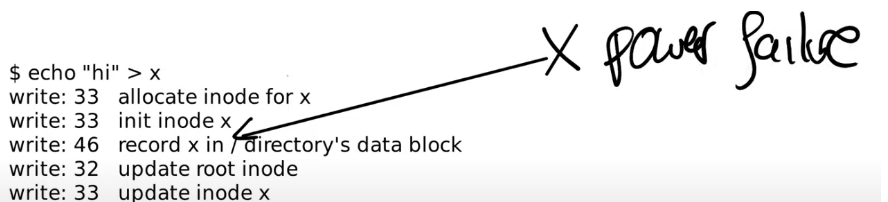
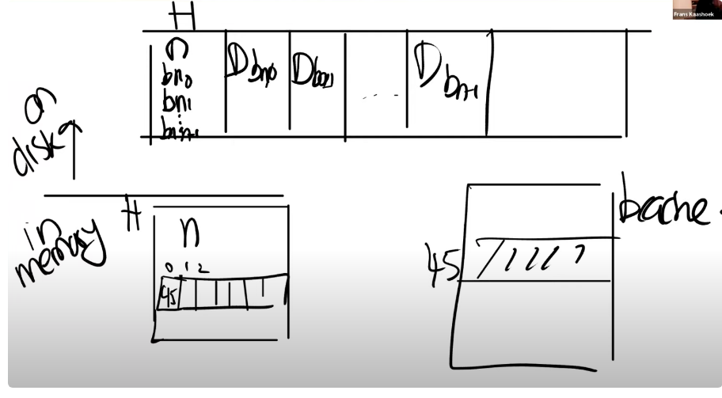
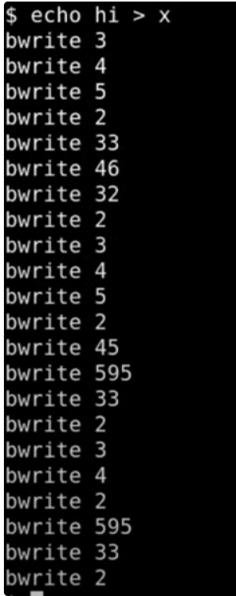

# 文件系统

## 文件系统的特性

1. 文件系统使用了文件名 `<u>`，递归的结构 从根目录开始进行组织所有的文件和文件夹
2. 文件名可以很好记忆，可以使得在不同的用户之间和不同的进程之间更加方便的使用需要的文件
3. 文件系统支持 `持久化`的功能,为了避免计算机崩溃导致文件丢失

## 文件系统的运行机制

1. 文件系统将 `<u>`硬件 `</u>`进行了抽象，对应的硬件同样和之前的**UART**类似，在软件层面具有驱动，驱动也是分为了 `top`和 `bottom`部分，top可以使得内核能够调用相应不同的函数，bottom就是中断处理函数
2. crash safety 避免计算机崩溃之后数据的丢失
3. 文件系统在磁盘上的排布，计算机中一切皆文件，目录也是文件，但是都是在磁盘上保存的数据结构
4. 性能，操作硬件的性能都比较慢，所以我们需要避免进行读写磁盘硬件，所以在文件系统的层状结构中有一个 `<u>`buffer cache（缓存）`</u>`，我们可以读写缓存，间之前读写过的数据读取，避免重复的查找

## 文件系统的概述

文件系统维护的数据结构就是 `indoe`

### inode

`inode`代表了一个 `文件对象结构`，这个文件结构里面就包含了文件的所有信息，里面的 `inode number`就是为了对inode进行 `索引`

> 文件系统只认识对应的 `inode`，而不认识文件名，
> 使用文件名主要是为方便用户的使用，在文件系统对文件的查找都是使用其 `inode number`

删除文件
--------

> * 删除文件不能随便删除，因为一个文件可能有多个硬链接(多个文件，但实际上是共享inode),每多一个硬链接，该inode的引用计数就++
> * inode里面维护了refcnt，相当于引用计数，只有当这个文件的引用计数为0的时候才能删除文件
> * inode里面还维护了一个openfd count,因为可能有多个进程都打开了这个文件，每次打开一次该文件，对应的openfd count++，关闭就--，
> * 只有当 `openfd count`和 `refcnt`都为0的时候，才能把对应的 `inode`给删除

## 文件系统的分层结构

文件系统的7层结构


* `disk<u>`这个是一个实际存储数据的存储设备，这个设备提供了持久化的存储,磁盘层读写和写入virtio硬盘上的块 `</u>`
* `buffer cache`:`<u>`这个buffer cache可以避免频繁的读写磁盘,我们就最经使用过的数据保存在内存里面,缓存磁盘块，确保每次只有一个内核进程可以修改存储在任何特定块的数据 `</u>`
* `logging`:`<u>`一次更新多个块，确保在崩溃的时候自动更新这些块，
* `inode cache`:`<u>`
* `inode<u>`提供单独的文件,每个文件表示为一个索引节点，
* `directory`:`<u>`目录层为每个目录实现一种特殊的索引，内容就是一些列的目录项，每个目录项包含文件名和索引，`</u>`
* `name/fd`:文件描述符的操作，抽象了很多资源，管道，设备，文件

## 磁盘布局

`sector`扇区就是磁盘读取的最小单位:512byte

`block`块，文件系统角度下磁盘和内存交互的最小单位1K，在LINUX下是 `<u>`4K `</u>`

---

在xv6中我们把磁盘抽象成了一个大的数组

把磁盘分成了一个一个的block，都是1K大小

* block[0]:一般都是作为 `<u>`boot sector `</u>`来启动操作系统，不使用（他保存引导扇区）
* block[1]：`<u>`super block `</u>`,包含了文件系统的系统信息，里面的数据很重要，数据块数，inode节点数和日志块数，super block由一个mkfs的单独日志块来填充
* blcok[2]-blcok[31]:`<u>`log block `</u>`,里面都是文件系统的日志块，
* block[32]-block[44],里面**存储了所有inode的数据结构**，一个inode是64字节，一个块1024字节，所以一块里面只能存**16**个inode，每个块里面可以有多个inode节点
* block[45]:bitmap block,可以用来查看某个数据块是否被空闲，位图的方法，bitmap中1的位置代表是第几个block，map中的0或1代表这个位置是否被使用
* block[46]-：后面就全部都是数据块，里面包含的就全都是数据了

## inode的布局

```c
// in-memory copy of an inode
struct inode {
  uint dev;           // Device number
  uint inum;          // Inode number
  int ref;            // Reference count
  struct sleeplock lock; // protects everything below here
  int valid;          // inode has been read from disk?

  short type;         // copy of disk inode
  short major;
  short minor;
  short nlink;        //link计数器，跟踪当前inode被多少个文件名指向
  uint size;          //表明了文件数据有多少字节
  uint addrs[NDIRECT+1];
  //这个地方的addrs，就是用来索引block number，通过block number可以索引到对应的数据
  /*
  1. 有12个direct block number，通过这12个direct number，我们可以直接索引到blcok number对应的数据块内容
  2. 有1个indirect block number：类似页表的3级映射，我们这个就是通过这个indirect number，可以查找到内存中存在的256个direct number中的一个条目
  
  */
};
```

## 文件系统的创建概述

我们在qemu上输入

> make qemu
>
> echo hi > x

我们经过了代码的处理，会出现一些write

```c
---创建x文件
write:33--->分配inode，把inode的结构体分配在block33处,标记该inode被使用，我们使用type来表示inode是否空闲,
write:33--->这个33,就说明的是我们写一些数据到inode里面，比如link count=1,之类的
write:46--->这个46,就是向data block里面写数据，data block里面就全部都是文件的数据内容，46是根目录，因为我们创建了一个文件，他属于根目录下的一个文件，有文件名和inode的编号，
write:32--->这个里面就是更新根目录的inode，更新inode size之类的
write:33---> update inode x

---将hi写入到x文件里面
write:45---> 更新bitmap，文件系统会扫描bitmap中没使用的data block，找到对应的bit=0,设置bit=1,更新bitmap 
write:595--->这个就是往block[595]这个块里面写数据，h，下面的也是
write:595
write:33--->更新该文件inode的size 大小

---
将\n写入到x文件里
write:595--->向block[595]里面写数据\n
write:33 --> 更新inode的大小
```

这里会有一些阶段

## sleeplock

### 注意

* 对于内存中，一个blcok只能有一个缓存
* 在IO过程中使用sleeplock而不是spinlock，因为spinlock只适合短时间的，而sleeplcok适合使用在长时间的
* 采用LRU作cache替换
* spinlock来保护buffer cache的内部数据，sleep lock来保护单个block的cache

# crash recovery

## 文件系统崩溃的综述

crash 或者电力故障会导致磁盘文件处在一个不正确的状态

* 一个data blcok属于两个文件
* 一个inode被分配给了两个不同的文件

文件系统的故障我们是希望能在故障之后还能使用，避免数据的丢失

系统崩溃的解决方法就是logging

我们在创建文件的时候，写文件这样的文件系统操作，

* 分配inode，在磁盘上设置为已经分配
* 更新文件目录的data block

文件系统的属性

* 磁盘block要么空闲要么已经分配给了一个文件

## file system crash的示例

```c
---创建x文件
write:33--->分配inode，把inode的结构体分配在block33处,标记该inode被使用，我们使用type来表示inode是否空闲,
write:33--->这个33,就说明的是我们写一些数据到inode里面，比如link count=1,之类的
write:46--->这个46,就是向data block里面写数据，data block里面就全部都是文件的数据内容，46是根目录，因为我们创建了一个文件，他属于根目录下的一个文件，有文件名和inode的编号，
write:32--->这个里面就是更新根目录的inode，更新inode size之类的
write:33---> update inode x
```



如图，我们再33-46之间崩溃

> 假如在初始化一个inode的时候发生了crash，后我们又重启了计算机，我们重新进入的时候，分配的 `inode`就丢失了(因为这些都是在**内存**上操作的)
>
>> 因为这个inode还没有添加到对应的目录下能够进行对应的索引，所以没有出现在任何的目录下
>>
>> ---
>>
>> 同样我们也不能够删除这个inode，还占用了资源。
>>


这次我们在32--33之间崩溃

如果我们先写入到对应的目录下，在分配inode

> 这个操作可以解决inode丢失的问题，但是同样也会出现很多问题，出现crash之后
>
> 我们会在目录下面读取一个未被分配的inode，(但是这里的write 46是什么意思呢？)
>
> **会出现不同的文件贡献一个inode，可能reboot回来之后，我们又write46，这个时候有两个文件，那么可能他们会读取同一个inode，两个文件进行贡献**


这次我们再 45--595之间崩溃

> 这里我们先把 `block bitmap`先分配出来一个 `data block`，但是没有把对应的inode更新他的 `size`和 `block number`，这个 `inode `无法索引到自己的 `block data`


这次在调整了顺序在33-45之间崩溃

我们先更新inode，后分配bitmap

> 这里会出现问题，先更新inode，但是我们不知道应该要更新多少大小，以及分配的block number在哪里，因为还没有分配bitmap

> 这是可能认为595是属于x的，但在磁盘上还是属于没有分配的状态，所以，此时崩溃的话，block 595可能会另一个文件给分配走，此时两个文件都认为这个595属于自己，彼此读写互相的数据，

## log工作

1. log write

> 将数据从内存先写到磁盘上的log区域，这个地方崩溃了，可以当作这个系统调用没发生过一样

2. commit

将一个系统的文件操作结束log write的全部流程，记录下有多少次操作，这个次数是原子的，要么有 `定值`，要么 `0，相当于系统调用完成了`

3. install

> 把在log区的数据分发到对应的位置，这个地方崩溃，可以再读取log block ，把里面的数据安装到对应的位置上，`redo log`

> redo log的操作影响不大，install 是 `幂等操作`,执行一次和执行多次的效果是一样的，

4. clean log

> 清理log区的数据

### xv6的内存磁盘文件结构



## log磁盘写流程、



> 3,4,5:执行的就是将数据先保存到log data block里面

> 2:将log里面的数据commit，完成所有的操作

> 33,46,32将数据从log data block里面 `install`到实际的data block里面

> 2:将log header记录清空

## file system challenges
